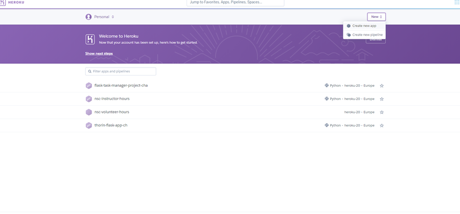
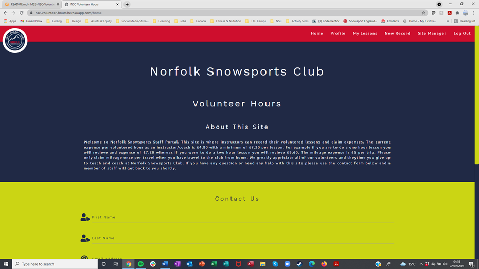
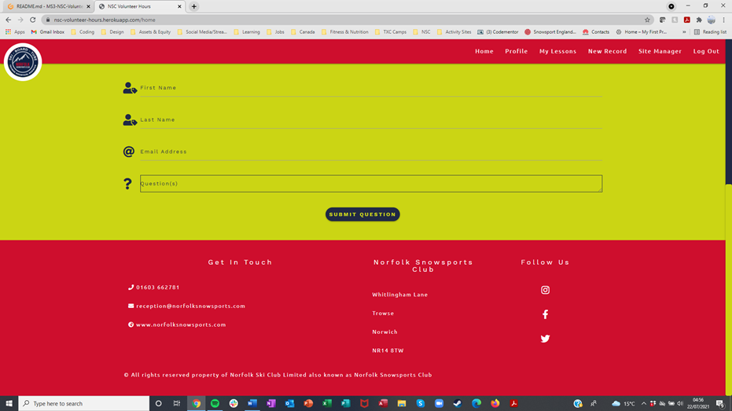

# Norfolk Snowsports Club (NSC) Volunteer Hours website

## Python and Data Centric Development Milestone Project.

---

This site has been created to reduce the amount of admin work at Norfolk Snowsports Club and allow instructors a place where they can see their current expenses due and hours volunteered.

---
---

## Table of contents

---

- [UX](#ux)
    - [Project Goals](#project-goals)
    - [User Goals](#user-goals)
    - [User Stories](#user-stories)
    - [Wireframes](#wireframes)
    - [Surface](#surface)
- [Backend](#backend)
    - [Database](#database)
    - [Database Schema](#database-schema)
    - [MongoDB](#mongodb)
- [Features](#features)
    - [Navigation Bar](#navigation-bar)
    - [Home Page](#home-page)
    - [Future Features](#future-features)
- [Technologies used](#technologies-used)
- [Testing](#testing)
    - [Functionality Testing](#functionality-testing)
    - [Compatibility Testing](#compatibility-testing)
    - [User Story Testing](#user-story-testing)
    - [Issues and bugs](#issues-and-bugs)
    - [Performance Testing](#performance-testing)
    - [Code Validation](#code-validation)
- [Deployment](#deployment)
- [Credits](#credits)
    - [Learning resources and styling ideas](#learning-resources-and-styling-ideas)
    - [Code](#code)
    - [Images Used](#images-used)
- [Project Screenshots](#project-screenshots)

---
---

## UX

---

### Project goals

The primary goal of the NSC Volunteer Hours website is to reduce the amount of admin work needed when volunteer instructors submit their hours at Norfolk Snowsports Club, NSC. Currently instructors complete a lesson, write their hours in a daily log then this in manually input onto an access database and an excel sheet. The expenses are then caluclated, printed and sent to accounts for accounts to type the information into their excel sheets. This site will allow instructors to enter their details and their expenses will automatically be calculated saving hundreds of hours a year in admin time.

The secondary goal is to provide instructors a place where they can easily see their recent hours worked, their expenses due and their freetime accrued. Typically instructors can only see this information once every three months when their expenses statements are print but this site will allow them live view of all their record hours at any one time.

### User goals

#### User goals:

The users will be volunteer ski and snowboard instructors and coaches.

* Users can add the lessons they have completed.
* Users can see the lessons they have added.
* Users can update and delete the lessons they have added.
* Users can Search for lesson by their type/category.

#### Site Admins Goals:

The site admin will be NSC employees.

* Admin can view, edit and delete any and all lessons input by instructors.
* Admin can add new records of lessons on an instructors behalf.
* Admin can add new lesson types/categories and edit existing ones.
* Admin can view and edit users.

### User Stories

#### As an instructor I would like to:

* Easily add lessons I have done to the NSC Volunteer Hours Site.
* View all my lessons volunteered.
* Edit and delete any records I have incorrectly added.
* See an overview of the hours I have volunteered and the expenses due.
* Manage my account information.

#### As an Admin User I would like to:

* View all submitted hours.
* Edit and delete any records that are incorrect.
* See an overview of all hours and expenses.
* Easily search for a user or a lesson type/category.
* Edit user information.
* Add and Edit new and existing lesson types/categories.
* Input lesson information on an instructors behalf.

### Wireframes

I used [Balsamiq.com](https://balsamiq.com/) to create the wireframes.

Please see below for all the wireframs:

Small Screen Sizes:

Larger Screen Sizes:

### Surface

#### Colours

Main colours used in project:

* Primary colour one - HEX: #202945, RGB: R: 32 G: 41 B: 69
* Primary colour two - HEX: #ce0e2d, RGB: R: 206 G: 14 B: 45
* Secondary colour one - HEX: #fff, RGB: R: 255 G: 255 B: 255
* Secondary colour two - HEX: #cbd514, RGB: R: 203 G: 213 B: 20

#### Fonts

* Primary font - 'Work Sans' was chosen as this is part of Norfolk Snowsports Clubs brand image and this is a clear, easy to read font.
* Secondary font - 'Ubuntu' was chosen as this is part of Norfolk Snowsports Clubs brand image and tis is also a clear, easy to read font.
* Back-up font - 'sans-serif' chosen as a back-up to the primary and secondary fonts for is wide acceptability accross platforms and it's clear, easy to read properties.

The above fonts are perfect for a website aimed at staff/volunteers. The users are here to input thier lesson not see overly fancy, difficult to read font.

#### Images & logos

No images as such have been used for this website as this site is intend as a site for staff and volunteers therefore by reducing distractions this will increase efficiency.

The Norfolk Snowsports Club Logo has been used and this is linked in the header of the base.html file.

Back to [Table of Contents](#table-of-contents)

---
---

## Backend

---

### Database

The database, volunteer_hours, consists of 3 collections:

* Users - used to store users personal details and login information.
* Lessons - used to store all submitted lesson records.
* Activities - used to store all submitted activity types.

### Database Schema

The Lessons collection is linked to the users collection from the lesson entry_by to user id and the lessons collection is linked to the activities collection from the lesson lesson_type to the activites id.

### MongoDB

Mongo Db was chosen as it is user friendly, easy to use and supports non ralational databases.

Back to [Table of Contents](#table-of-contents)

---
---

## Features

---

This website consists of 13 pages using templating language to load these inside the base.html page. The website pages and features are as follows:

### Navigation bar

* The navigation bar is fixed at the top of every page so user can easily navigate between the pages and have a point of reference.
* The site logo acts as a home button returning users to the home page when clicked.
* For smaller screen sizes the navbar links will collapse into a hamburger menu which is expected amungst most mobile sites now.
* Admin user will have a couple of different navbar links appear/change that normal users can't see allowing them to access pages only used for admin.

### Footer

* The footer shows information include contact details, address and copyright info.
* The footer has links to the clubs social media sites.
* Club website is also linked in the footer and can also be clicked.
* All external links open in new tabs.

### Home Page

#### About This Site Section

* The about us section has a small amount of information about how expenses are calculated and a brief description of why this site was created.

#### Contact us Section

* This allows users to contact admin staff with questions.
* Form responds to user input.
* The form has an alert that informs the user that their message has been sent.
* The form will also display a message if an input isn't accepted and why.

### Login Page

* Clear easy to understand login page that accepts correct username and password combination.
* Flash message displayed if username or password is wrong.
* Automatic redirect to profile page when username and password is correct.
* Flash message displayed when redirected to the profile page.
* The input fields will also display a message if an input isn't accepted and why.
* Call to action below login button for people who need to register. This can be clicked to link them to register page.

### Register Page

* Clear easy to understand register page that accepts takes a variety of personal details.
* The input fields will display a message if an input isn't accepted and why.
* Call to action below register button for people who need to login instead of register. This can be clicked to link them to login page.
* Automatic redirect to profile page when form is complete and button is clicked.
* Flash message displayed when redirected to the profile page.

### Profile Page

* Users information automatically populates the form fields.
* Username is displayed but cannot be edited to avoid any bugs that will be caused in the records pages.
* User password is hidden to avoid any chace of this being corrupted or recorded by a third party.

### Edit Profile Page

* Users information automatically populates the form fields making it easier and quicker to submit when small changes are made.
* Users usname is displayyed above so the user knows they're editing their profile.
* Automatic redirect to profile page when changes are submitted.
* Flash message displayed when edits are submitted.

### My Lessons Page

* Search bar to allow users to easily search the lesson type and user fields.
* Table displaying all input records.
* Functionality behing the table automatically calculates expenses due and displays these.
* Edit button which directs the user to the edit record page.
* Delete button to allow users to delete their own records.
* Delete button has an alert to confirm if the user wishes to delete the record.
* For smaller screen sizes the table becomes scrollable so the information doesn't have to be push together and so the user doesn't have to move the entire page.

### New Record Page

The user doesn't need to type anything making this information easier to input, reducing human error and making this app much more mobile friendly.

* New record page allows user to easily input their lesson information.
* Appropriate icons to assist with the readability of the form.
* Lesson date allows users to select the date from a callender so this does not have to be typed.
* Lesson start and finish times allow users to select a time from a clock so this does not have to be typed.
* Hours and lesson type input fields both have drop downs allowing the user to select the correct option without having to type anything.
* Switches used for mileage and expenses which allow the user an easy way of claiming this expenses.
* Expenses? field starts on as most people claim this and Mileage? is off as not as many people claim this.
* Automatic redirect to lessons page when record is submitted.
* Flash message displayed when record is submitted o inform user that record has been added.

### New Record Admin Page

This has all of the above features from New Record Page and the following:

* Only accessable by Admin user.
* Allows the admin user to input the username of the instructor whos lesson the record relates to.

### Edit Record Page

* Lesson information automatically populates the form fields making it easier and quicker to submit when small changes are made. This also reasures the user they are editing the correct record.
* Automatic redirect to lessons page when changes are submitted.
* Flash message displayed when edits are submitted.

### Site Manager Page

* This page also admin user to add new activities and edit current activities.
* No delete option to avoid any potential data corrupiton.
* Statistics section displaying a total of hours, expense and mileage.
* User profile section where admin can see all user and edit.

### New Activity Page

* Clear easy to understand new activity page that allows users to add an activity.
* Automatic redirect to site manager page when activity is submitted.
* Flash message displayed when activity is submited

### Edit Activity Page

* Clear easy to understand edit activity page that allows users to edit an activity.
* Automatic redirect to site manager page when edit is submitted.
* Flash message displayed when edit is submited.

### Future Features

* Allow admit to edit home page from the site manager page use templating.
* Confirm password field when users are registering to ensure the correct password was input.
* Back end checks to check the session user is indeed admin so the pages can't be broken into as easily.
* Seperate lessons on the lesson table by month, quarter and year.
* Provide statistics for the totals of lesson values for month, quater and year.
* Compare month on month, quarter on quarter and year on year values in site manager page.
* Allow users to email themselves a table of their records.
* Input accurate mileage figures and have this calculated in the table.
* Show a record of expenses per user.

Back to [Table of Contents](#table-of-contents)

---
---

## Technologies used

---

#### HTML5

* Used as a structural language.

#### CSS

* Used as a style language.

#### JavaScript

* Used JavaScript as a scripting language.

#### Python

* Used Python as a programming language.

#### Font Awesome

* [Font Awesome](https://fontawesome.com/) was used for social links, skiing and snowboarding headings and for table headings.

#### Google Fonts

* [Google Fonts](https://fonts.google.com/) used as a font resource.

#### GitHub

* [GitHub](https://github.com/) was used as the site's repository.

#### Materialize

* [Materialize](https://materializecss.com/) was used as a framework.

#### Gitpod

* [Gitpod](https://gitpod.io/workspaces/) was used as a development hosting platform.

#### Heroku

* [Heroku](https://www.heroku.com/) was used as a cloub application platform.

#### MongoDB

* [MongoDB]() was used as a cloud database.

#### Wireframes

* [Balsamiq.com](https://balsamiq.com/) was used as a wireframe tool to sketch the structure of the site.

#### DBDiagram

* [DBDiagram](https://dbdiagram.io/home) was used to build the sites database schema.

Back to [Table of Contents](#table-of-contents)

---
---

## Testing

---

### Functionality Testing

I used google chrome developer tools throught this project to test the structure, styling and responsiveness of the site. I used the CLI and python3 to test some functions and I also used Python Tutor to test some code.

#### Tested:

#### Responsiveness

Expected: the site was expected to respond to the screen size and have no visable white space or overlaps.

Testing: This was tested by using google inspect to resize the page and a Honor P30 pro smart phone.

Result: The site responds as expected for for small screen sizes and up. Some small fixes had to be made to achieve this.

Fix: Media query for small screens so the content takes up the full width of the app.

#### Navbar

Expected: Navbar to adjust to the screen size and all links to work.

Testing: This was tested by using google inspect to resize the page and a Honor P30 pro smart phone.

Result: Navbar links all work and the logo also acts as a link to the home page. The navbar collapses into a mobile friendly hamburger menu when a smaller screen size is reached. Some small fixes had to be made to achieve this.

Fix: Classes had to be added to fix the hamburger menu useability. The side menu wasn't acepting any user actions.

#### Colour Contrast

Expected: Also background and foreground colours are expected to pass a contrast test in google developer tools.

Testing: Google developer tools was used to test the contrast. Elements, text and backgounds were hovered over to show the contrast rating.

Result: All elements pass this test. The primary and secondary colours were all checked in advance for contrast to speed the process of checking this up.

#### Buttons and links

Expected: It's expected that also buttons link to the appropriate pages.

Testing: This has been tested on both windows and android. I have gone trough and clicked everything button and link.

Result: All buttons and links worked as expected and directed me to the appropriate pages. Small fix needed.

Fix: The website link in the footer was opening the site over this app so a blank target was added to rectify this.

#### Contact Form

Expected: It was expected that the completed form would auto populate an email and send this to the site owner when submitted.

Testing: Filled out the contact form and submitted.

Result: This email was sent and recieved as expected. Small change made.

Fix: Code was added to ensure an alert would show so users knew the form was sent otherwise without this it was very difficult to tell.

#### Profiles and Editing

Expected: Expected the users personal information to show in the profile and editing this to correctly send the changes to the databases.

Testing: Loaded the profiles page and checked the information match that of the information in the database. Edited the information and checked the returned new values were those of which were edited.

Result: Profile and edit profile page both display the correct information and behave as expected.

#### Search Bar

Expected: It's expected that the search bar will find user and/or lesson type values and return these for the user to see.

Testing: Input different values to check the correct records with these values were returned.

Result: The search function returned the correct values and behaved as expected.

#### Lessons Table

Expected: This table is expected to show to records input by the user and allow the user to edit or delete, with confirmation, the record.

Testing: Records were edited and deleted to check these functions work.

Result: This table, contents and buttons displayed as expected. Minor fix needed to allow for a delete confirmation.

Fix: Delete confirmation alert was added to ensure no records are accidently removed.

#### Adding Records

Expected: It is expected that all input data is saved to the dataebase and displayed in the lessons page.

Testing: Lots of records with different values were added then check in the table. The databases raw data was also check to see if the submitted information was present.

Result: All records were correctly submitted and the data was within the database collection. Page and function responds as expected.

#### Adding and editing activities

Expected: This was expected to add new activities to the activities displayed in the drop down list in new records and on the cards on the site manager page. Also any edits made the appropriate changes to the cards, drop down list and database.

Testing: Added new activities and checked they were present on the site manager page and the new record drop down field for lesson_type. The database collection was checked against the site manager activies to check the were all loading properly.

Result: Adding activies behaved as expected.

#### Statistics

Expected: the statistics section on the site manager page is expected to keep a running total of hours, expenses and mileage.

Testing: New records were added and removed to check the values changed. The total was manually calculated from the lessons table and the answers checked against the statistics section.

Result: All values were accurate and the statistic behave as expected.

#### User profiles and edit

Expected: expected to see all user profiles displayed and when the edit button is clicked, to be diverted to an edit page for that users profile.

Testing: checked the user profile values displayed against those in the databases users collection. Clicked on the edit buttons to check the correct page was loaded.

Result: This behaved as expected.

#### Log Out

Expected: It's expected that the user is logged out.

Testing: Clicked the log out button from many different pages.

Result: The log out navbar option behaves as expected and logs the session user out.

### Compatibility Testing

This site was tested across the following devices and browsers:

#### Devices

* Hp Laptop using windows 10 home
* Honor 20 pro mobile phone

All devices tested fuctioned as expected.

#### Browsers

* Google Chrome
* Mozila Fox
* Microsoft Edge

All browsers tested fuctioned as expected.

### User Story Testing

#### As an instructor I would like to:

* Easily add lessons I have done to the NSC Volunteer Hours Site.
    * This can be achieve through the new record page.
* View all my lessons volunteered.
    * All records can be view on the lessons page.
* Edit and delete any records I have incorrectly added.
    * Edit and delete buttons are present for every record in the lessons page.
* See an overview of the hours I have volunteered and the expenses due.
    * Expenses are calculated and sent back with the table for instructors to view.
* Manage my account information.
    * Profile can easily be edited from the edit profile page accessed throung the profile page.

#### As an Admin User I would like to:

* View all submitted hours.
    * These records can all be viewed in the lessons page.
* Edit and delete any records that are incorrect.
    * These records can all be edited or deleted from the lessons table.
* See an overview of all hours and expenses.
    * This can be seen from the lessons table on the lessons page also there is and overall running total in teh statistics section of the site manager page.
* Easily search for a user or a lesson type/category.
    * Search bar available at the top of the lessons page to allow users and admin to search for a lesson type or user entered lesson.
* Edit user information.
    * User profiles can easily be edited from the edit profile page accessed throung the profile page or the user profiles table on the site manager page.
* Add and Edit new and existing lesson types/categories.
    * New avtivities/lesson types can be easily added in the site manager section.
* Input lesson information on an instructors behalf.
    * Admin can select a user when submitting a new record so entries can be added by staff on an instructors behalf.

### Issues and bugs

All issues and bugs were found using google inspect and the responsive design tools, python tutor, CLI and console warnings.

Below I have explained the issues and how they were resolved:

Fixed mistake where I removed the ';' in the email javascript.
* input the missing ';'

Fixed issue where admin user could be picked as the record entry
* Used templating to disable to username = to the admin username.

Fixed issue where when website was clicked in footer it wouldn't load in a new tab.
* Added the target blank attribute to ensure this loads in a new tab.
 
Fixed issue where some form fields where not showing visable validation when the field was complete or not.
* Added functionality to the script.js file and the validate tribute to the elements to fix this.

Fixed issue where manage activity cards would come out of line when screen size was reduced
* Added a consitant height to all the cards so the stay in the appropriate format.

Fixed issue where manage activites was showing on a phone to anyone
* Added the appropriate templating to the sidnav in base.html to hide this from all users bar admin.

Fixed issue where editing profile would remove username and password. Added total column to lessons table
* Called the key values indvidually instead of updating the whole dictionary. Didn't call the username or password field so these wouldn't be changed.

Fixed issue where lesson header would scroll with table
* Moved the header into its own row outside of the template for loop and class that is targeted for the styles overflow.

Fixed issue where dropdown for activity wasn't showing correctly in lesson edit and how if a user edited a lesson it over wrote the original users username
* Input activity.activity_name instead of activity.lesson_type in html. used insert on istead of update and dictionary to target indiviual fields in the edit lessons page.

### Performance Testing

#### Performance

The sites performance has been optimized by reducing the amount on unnecessary content on the site. There is no image and the content is straight to the point.

#### Accessability

The accessabilty has been optimized by giving alt tags a value and having screen reader set for icon links.

#### Best Practices

Best practices has been optimized by having clear constitent indentaition throughout, lots of notes and double checking this through validators.

#### SEO

The SEO has been optimized by adding meta tags in particular the meta description and keeping all content relevant.

### Code Validation

The code used for this site was validated using the following sites:

* [W3C HTML Validator](https://validator.w3.org/#validate_by_input)
* [W3c CSS Validator](https://jigsaw.w3.org/css-validator/#validate_by_input)
* [JavaScript Validator](https://beautifytools.com/javascript-validator.php)
* [Python PEP8 Validator](http://pep8online.com/checkresult)

Back to [Table of Contents](#table-of-contents)

---
---

## Deployment

---

This project was deployed on heroku. I used gitpod as a development environment where all the changes were committed to the GitHub repository for version control. Heroku then recieved this information to keep the app up to date and current.

The project is deployed here: [https://nsc-volunteer-hours.herokuapp.com/](https://nsc-volunteer-hours.herokuapp.com/)

To deploy I had to:

Login and create a new app as shown below:

Name the app and select the closets region in my case Europe then create app:

On the deploy tab under deployment method click GitHub and the type the repositories name search. When you've found the correct repository connect and then scroll down and click deploy automatically:

Next go to settings and add the config vars: 

When this is done return to the deploy tab and click deploy branch: 

The project is now deployed to Heroku.

Back to [Table of Contents](#table-of-contents)

---
---

## Credits

---

To complete this project I used Code Institute student template: [gitpod full template](https://github.com/Code-Institute-Org/gitpod-full-template)

### Learning resources and styling ideas

Throughout learning with code institute I have researched and learnt using the following sites and courses:

* [Code Institute](https://learn.codeinstitute.net/login?next=/dashboard)
    * Throughout this project I have referred back to lots of different modules to refresh myself on good practices.
* [W3Schools](https://www.w3schools.com/)
    * I have used this site throughout the course when looking for ideas or potential stylings to code.
* [Materialize](https://materializecss.com/)
    * I used materialize for its grid system and styling. This was a good starting point for my project.
* [Norfolk Snowsports Club](https://www.norfolksnowsports.com/)
    * This is the main club website for customers and to keep things consitent I used the brand colors and fonts to keep a constent brand image across customer and staff sites.
* [You Tube](https://www.youtube.com/)
    * At times throughout the Python and Data Centric Development section of this diploma I have whatch tutorials and videos explain functions and best practices for javascript, python, jquery and databases.

### Code

I have refactored a lot of the css and some of the python. Both could still have further refactoring in the future. the HTML, CSS, JavaScript and python all have lots of notes so when this code is revisted in the future it's easy to manipulate and understand.

### Images and Logos Used

No images as such have been used however the NSC logo being used is displaying via a href. 

Back to [Table of Contents](#table-of-contents)

---
---

## Project Screenshots

---

Back to [Table of Contents](#table-of-contents)

---
---

Thank you for Reading! 

This project was built by Charlie Storey.